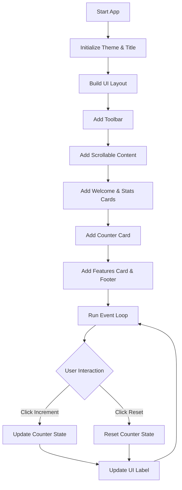

# 🚀 Kivy MDApp Project

A modern Python GUI application built with **Kivy** and **KivyMD**, featuring Material Design components and cross-platform support.


---

## 📋 Table of Contents

- [Way of Working](#-way-of-working)
- [Project Architecture](#-project-architecture)
- [Features](#-features)
- [Prerequisites](#-prerequisites)
- [Installation](#-installation)
- [Quick Start](#-quick-start)
- [Building APK](#-building-apk)
- [Resources](#-resources)

---

## 🔄 Way of Working

This diagram illustrates the application lifecycle and the interactive counter logic implemented in `main.py`.



---

## 📂 Project Architecture

### Exhaustive Project File Table

| File                                                                                                                           | Description                                                                                                                   |
| :----------------------------------------------------------------------------------------------------------------------------- | :---------------------------------------------------------------------------------------------------------------------------- |
| [`main.py`](file:///c:/Users/ACER/Desktop/Ayush/test/test/projects/Exported/Rahidul/Python_Kivy_App/main.py)                   | Main application entry point. Contains the `MainApp` class, UI construction logic, and event handlers for the counter system. |
| [`build.md`](file:///c:/Users/ACER/Desktop/Ayush/test/test/projects/Exported/Rahidul/Python_Kivy_App/build.md)                 | Comprehensive step-by-step guide for building the Android APK using Google Colab and Buildozer.                               |
| [`requirements.txt`](file:///c:/Users/ACER/Desktop/Ayush/test/test/projects/Exported/Rahidul/Python_Kivy_App/requirements.txt) | Dependency manifest file listing required Python packages for installation.                                                   |
| [`.gitignore`](file:///c:/Users/ACER/Desktop/Ayush/test/test/projects/Exported/Rahidul/Python_Kivy_App/.gitignore)             | Git configuration to exclude environment files and temporary build artifacts from version control.                            |
| [`README.md`](file:///c:/Users/ACER/Desktop/Ayush/test/test/projects/Exported/Rahidul/Python_Kivy_App/README.md)               | Primary project documentation following the Documentation Sentinel standard.                                                  |

---

## ✨ Features

- **Modern Material Design UI**: Built with KivyMD components for a premium look and feel.
- **Interactive Demos**: Integrated counter demonstration showcasing state management.
- **Cross-platform**: Seamlessly runs on Windows, macOS, Linux, and Android.
- **Responsive Layouts**: Designed to adapt to various screen sizes using Kivy's flexible layout system.
- **Easy Deployment**: Standardized APK building process via Google Colab.

---

## 📦 Prerequisites

- **Python 3.12** or higher
- **pip** (Python package manager)
- **Virtual Environment** (recommended)

---

## 🛠️ Installation

### 1. Create Virtual Environment

```bash
# Windows
python -m venv kivy_venv
.\kivy_venv\Scripts\Activate.ps1

# macOS/Linux
python3 -m venv kivy_venv
source kivy_venv/bin/activate
```

### 2. Install Dependencies

```bash
pip install -r requirements.txt
```

---

## 🚀 Quick Start

Run the application locally to test the UI:

```bash
python main.py
```

---

## 📱 Building APK

The project uses **Buildozer** for packaging. Due to the complex setup required for Android-NDK, we recommend using Google Colab.

Follow the detailed instructions in **[build.md](build.md)** to:

1. Initialize Buildozer.
2. Configure `buildozer.spec`.
3. Build and download your debug APK.

---

## 📚 Resources

- [KivyMD Documentation](https://kivymd.readthedocs.io/)
- [Kivy Official Documentation](https://kivy.org/doc/stable/)
- [Buildozer GitHub](https://github.com/kivy/buildozer)

---

## 👨‍💻 Author

**Rahidul Khan**

---

**Last Updated:** February 18, 2026
**Environment:** Python 3.12.10 | Kivy 2.3.1 | KivyMD 1.2.0
